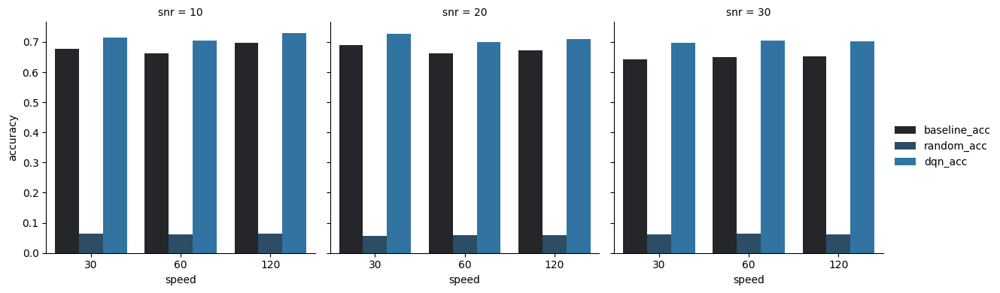

# RL-based Beam Selection in High-Mobility Wireless Environments

本專案針對**高速移動場景**的無線通訊系統，實作並比較傳統基準法（Baseline）、隨機選擇（Random）以及深度強化學習（DQN）等 **beam selection** 策略，探討**不同移動速度、SNR、CSI 不完美（估測雜訊）等現實條件下之效能表現**。支援資料產生、模型訓練、批次 sweep、可視化分析，適合學術展示/求職作品集。

---

## 🌟 成果展示 | Results Visualization

<div align="center">

| 完美 CSI（無估測雜訊） | 不完美 CSI（csi_noise_std=0.2） |
|:---------------------:|:----------------------------:|
|     |            |

</div>

- **左圖**：完美CSI下，Baseline（最大SINR）接近理論上限，DQN 可達高水準，Random 很差  
- **右圖**：CSI帶有雜訊時（實際系統常見），DQN 仍可學習出強健策略，明顯優於 Random，略低於 Baseline

---

## 特色
- **MATLAB 通道模擬**：多種速度/SNR，自動產生資料集
- **自動化 RL 訓練與 sweep**：一鍵多組環境訓練，模型結果自動保存
- **完美/不完美 CSI 測試**：可設定通道估測雜訊（CSI noise）
- **多策略比較**：Baseline（理論上限）、Random、DQN Agent
- **TensorBoard/Notebook 可視化**：訓練過程與結果一目了然
- **專案模組化設計**：方便擴充先進 RL（LSTM/PPO/Transformer）

---

## 專案結構
```text
matlab/        # 通道/beam資料集產生
data/          # 訓練與測試資料 (僅保留sample)
utils/         # 資料讀取、驗證、工具
env/           # RL 環境接口 (OpenAI Gym)
agents/        # Baseline/Random/DQN agent
trainers/      # 各種訓練與評測腳本
notebooks/     # Jupyter 分析/繪圖
logs/          # TensorBoard 日誌
models/        # 訓練後模型（預設不上傳）
results/       # 統整結果 CSV


## 快速開始

# 1. 建立虛擬環境，安裝 requirements
python3 -m venv .venv
source .venv/bin/activate
pip install -r requirements.txt

# 2. 產生資料 (MATLAB)
cd matlab
# MATLAB 執行 generate_beam_dataset.m 產生 beam selection 訓練/測試資料
# （可設定不同 speed/SNR/CSI noise）

# 3. 批次訓練所有資料集並比較
python train_all.py

# 4. 可視化結果
tensorboard --logdir logs/dqn_tb       # 監控訓練曲線
jupyter notebook notebooks/analysis.ipynb  # 統計/繪圖/深入比較


## Citation / Reference
[1] Z. Feng and B. Clerckx, "Deep Reinforcement Learning for Multi-User Massive MIMO With Channel Aging," in IEEE Transactions on Machine Learning in Communications and Networking, vol. 1, pp. 360-375, 2023, doi: 10.1109/TMLCN.2023.3325299

