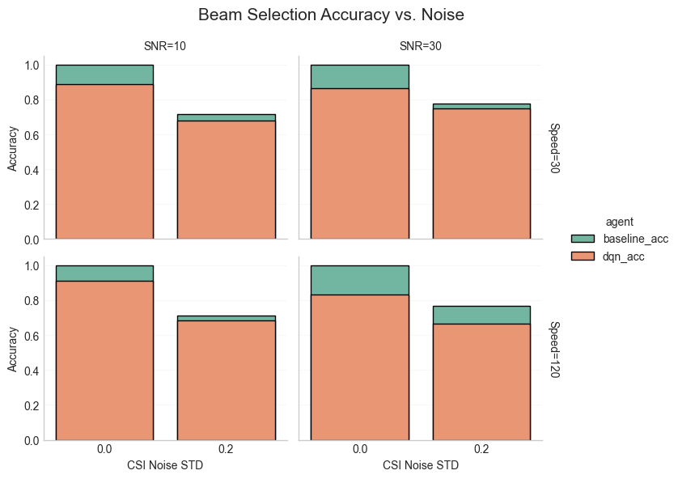

# RL-based Beam Selection in High-Mobility Massive MIMO

本專案聚焦於**高速移動場景下的 Massive MIMO Beam Selection**，比較傳統基準法（Baseline）、深度強化學習（DQN）等方法，探討不同移動速度、SNR、CSI 估測雜訊等現實通道條件下的波束選擇表現。專案涵蓋**通道建模資料產生、RL 訓練、策略評測與可視化分析**。

---

## 🌟 成果展示 | Results Visualization

<div align="center">

</div>

- 各子圖分別顯示不同 SNR（橫排）、速度（縱排）組合下，Baseline 與 DQN 在 CSI noise 為 0/0.2 時的準確率。
- **觀察重點**：
  - 無 CSI noise 時，Baseline 接近理論上限，DQN 亦能達到極高準確率。
  - 有 CSI noise 時，DQN 仍能學習出強健策略，優於隨機，與 Baseline 間的差距需視通道模型與 RL 設計。
  - 不同 SNR、速度、CSI noise 下可直接橫向比較各方法魯棒性。

---

## 🚀 專案特色 Features

- **MATLAB 產生物理真實資料集**：多用戶、多天線、多流、通道老化（Channel Aging）、CSI 雜訊等。
- **RL 環境自動 sweep**：Python (Gym) 封裝，支持多組參數自動訓練。
- **多種 Beam Selection 策略比較**：Baseline (Max-SINR)、DQN、（可擴充 Random, PPO, LSTM…）。
- **結果自動匯整、pandas/seaborn 視覺化**：一鍵匯出 summary.csv，方便統計與繪圖。
- **模組化架構**：便於增減資料集/方法/Reward function。

---

## 📁 專案結構 Project Structure

```text
matlab/        # 通道建模/資料集產生 (MATLAB)
data/          # 已產生資料集（csv，含多參數組合）
env/           # Beam Selection RL 環境（Python, Gym API）
agents/        # 策略實作（Baseline/DQN/Random…）
trainers/      # 訓練與評測腳本
results/       # Sweep 統計結果 summary
notebooks/     # 分析/繪圖 (Jupyter)
utils/         # 工具/資料讀取
```

---

## 快速開始 Quick Start

1. **建立虛擬環境並安裝依賴**

    ```bash
    python3 -m venv .venv
    source .venv/bin/activate
    pip install -r requirements.txt
    ```

2. **資料產生（MATLAB）**

    ```bash
    cd matlab
    # MATLAB 執行 generate_beam_dataset.m
    # 可自訂 speed/SNR/CSI noise
    ```

3. **批次訓練與策略比較**

    ```bash
    python train_all.py
    ```

4. **結果可視化與分析**

   - 監控訓練過程  
      ```bash
      tensorboard --logdir logs/dqn_tb
      ```
   - 統計/繪圖分析  
      ```bash
      jupyter notebook notebooks/analysis.ipynb
      ```

---

## 📚 參考文獻 Reference

[1] Z. Feng and B. Clerckx, "Deep Reinforcement Learning for Multi-User Massive MIMO With Channel Aging,"
IEEE Transactions on Machine Learning in Communications and Networking, vol. 1, pp. 360-375, 2023.
doi:10.1109/TMLCN.2023.3325299


